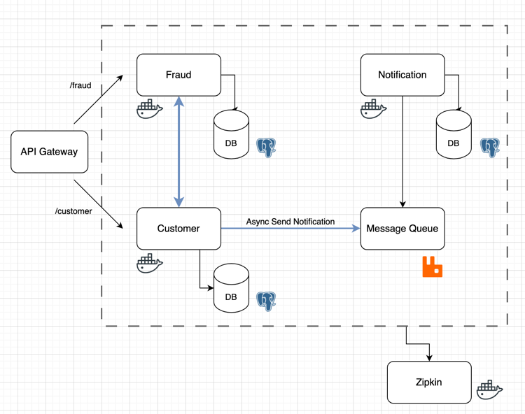

# microservices
This project aims to build a microservice architecture with three main services: customer, fraud, and notification using Spring Boot. The customer service is responsible for allowing customers to register, the fraud service can check if the customer is a fraudster, and the notification service sends messages to customers by taking messages stored in the message queue.
## Architecture

## Requirement
* Docker
* Minikube
## Getting Started
### Local Development
* `docker compose up -d postgres pgadmin zipkin rabbitmq`
### Docker
* `docker compose up -d`
### Kubernetes
Start Minikube
* `minikube start --memory=4g`

Create Postgres, Zipkin & Rabbitmq Services
* `kubectl apply -f bootstrap/postgres`
* `kubectl apply -f bootstrap/zipkin`
* `kubectl apply -f bootstrap/rabbitmq`

Create Customer, Fraud & Notification Services
* `kubectl apply -f services/customer`
* `kubectl apply -f services/fraud`
* `kubectl apply -f services/notification`

## Service Endpoints
###  Customer Service
* **POST** api/v1/customers - Registers a new customer
#### Request Body  
| Field      | Type    | Required | Description                       |
|------------|---------|----------|----------------------------------|
| first_name | string  | yes      | Customer's first name.            |
| last_name  | string  | yes      | Customer's last name.             |
| email      | string  | yes      | Customer's email address.         |
#### Example Request
```
###
POST http://localhost:8080/api/v1/customers
Content-Type: application/json

{
    "first_name": "John",
    "last_name": "Doe",
    "email": "johndoe@example.com"
}
```

###  Fraud Service
* **GET** api/v1/fraud-check/{customerId} - Checks whether a customer is a fraudster
###  Notification Service
  No endpoints exposed

## Notes
* customer service is a loadbalancer
* show zipkin dependencies?